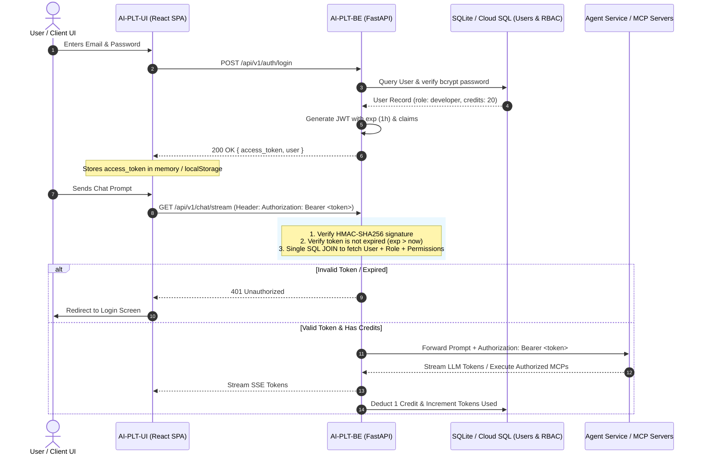

# Authentication & JWT Lifecycle Architecture

This sequence diagram illustrates the stateless JWT Bearer token authentication lifecycle, token expiration checks, and upstream delegation to downstream agent and MCP microservices.

