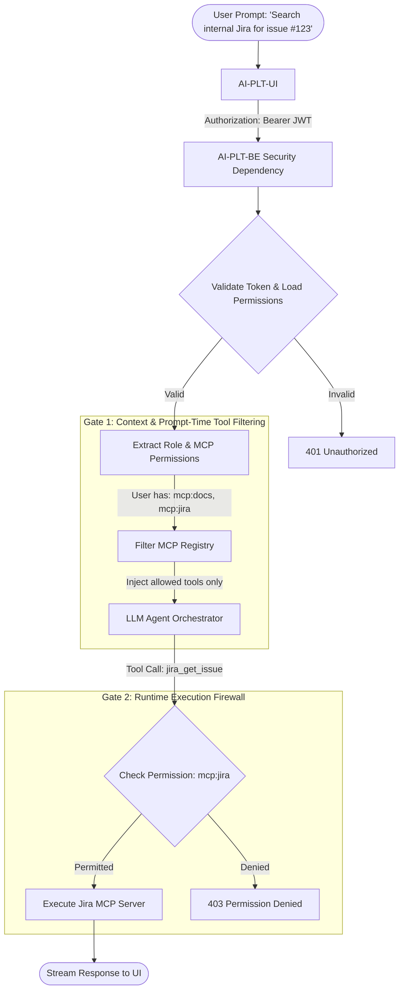

# Role-Based MCP Server Access Control Architecture

This diagram illustrates the two-gate security model for dynamic tool filtering and runtime execution protection.

```mermaid
flowchart TD
    User([User Prompt: 'Search internal Jira for issue #123']) --> Frontend[AI-PLT-UI]
    Frontend -->|Authorization: Bearer JWT| Backend[AI-PLT-BE Security Dependency]
    
    Backend --> AuthCheck{Validate Token & Load Permissions}
    AuthCheck -->|Valid| RBAC[Extract Role & MCP Permissions]
    AuthCheck -->|Invalid| Deny401[401 Unauthorized]

    subgraph Gate1 [Gate 1: Context & Prompt-Time Tool Filtering]
        RBAC -->|User has: mcp:docs, mcp:jira| Filter[Filter MCP Registry]
        Filter -->|Inject allowed tools only| LLM[LLM Agent Orchestrator]
    end

    subgraph Gate2 [Gate 2: Runtime Execution Firewall]
        LLM -->|Tool Call: jira_get_issue| Firewall{Check Permission: mcp:jira}
        Firewall -->|Permitted| MCP[Execute Jira MCP Server]
        Firewall -->|Denied| Deny403[403 Permission Denied]
    end

    MCP --> FinalResponse([Stream Response to UI])
```
