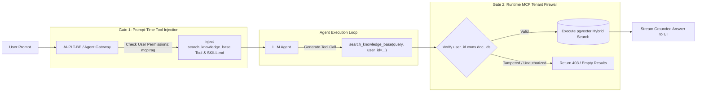

# Pure RAG MCP Server Architecture & Two-Gate Governance

This document describes the architectural design of the **Pure RAG MCP Server** in relation to [`AI-PLT-BE`](file:///Users/sarath/antigravity/AI-PLT-BE), the downstream Agent mesh, and Google Cloud infrastructure.

---

## 1. System Architecture Diagram

```mermaid
flowchart TD
    subgraph Clients ["Client Layer"]
        UI["AI-PLT-UI (React SPA)"]
    end

    subgraph BE ["AI-PLT-BE (Ingestion & Data Plane)"]
        UploadAPI["/api/v1/documents/upload"]
        QuotaCheck["Quota Enforcement (5 docs / 100MB)"]
        Parser["Parser (pypdf, python-docx, txt) & Chunking"]
        Embedder["Vertex AI Embeddings (text-embedding-005)"]
        ChatRoute["Chat API (/api/v1/chat & /stream)"]
    end

    subgraph DB [("Cloud SQL / PostgreSQL with pgvector")]
        DocsTable[("user_documents")]
        ChunksTable[("document_chunks (vectors + BM25)")]
    end

    subgraph MCP_Layer ["RAG MCP Server (AI-PLT-MCP-SERVERS)"]
        Tool1["search_knowledge_base(query, user_id, doc_ids, top_k, mode)"]
        Tool2["list_user_documents(user_id)"]
        Tool3["get_document_snippet(chunk_id, user_id)"]
        Prompt1["Prompt: rag_research_workflow"]
    end

    subgraph AgentMesh ["Agent Mesh / GCP Agent Gateway"]
        SkillFile["SKILL.md (Workflow Guide & Heuristics)"]
        Agent["Agent Orchestrator / Gemini 2.5 / LangGraph"]
    end

    %% Ingestion Flow
    UI -->|1. Multipart Upload| UploadAPI
    UploadAPI --> QuotaCheck
    QuotaCheck --> Parser
    Parser --> Embedder
    Embedder -->|2. Batch Insert Vectors| DocsTable & ChunksTable

    %% Agentic Retrieval Flow
    UI -->|3. Prompt + Attached Doc IDs| ChatRoute
    ChatRoute -->|4. Forward User Request + Context Meta| Agent
    SkillFile -.->|5. Workflow SOP Injection| Agent
    Agent -->|6. Autonomous MCP Tool Call| Tool1
    Tool1 -->|7. Read-Only Hybrid Query| ChunksTable
    Tool1 -->>|8. Ranked Relevant Chunks| Agent
    Agent -->>|9. Stream Grounded Response with Citations| ChatRoute
    ChatRoute -->>|10. SSE Stream| UI
```

---

## 2. Ingestion vs. Retrieval Separation of Concerns

| Area | Component | Responsibility |
| :--- | :--- | :--- |
| **Ingestion Plane** | `AI-PLT-BE` | File multipart upload, PDF/DOCX text extraction, recursive semantic chunking, Vertex AI batch embedding generation, storage quota validation (5 docs / 100MB), and PostgreSQL writes. |
| **Tool & Query Plane** | `rag-server` (MCP) | Read-only hybrid vector + BM25 search, Reciprocal Rank Fusion (RRF), chunk retrieval, document discovery, and tenant isolation filtering. |
| **Execution Plane** | Agent / GCP Gateway | Reasoning loop, transforming conversational questions into targeted search terms, invoking MCP tools, and grounding answers with citations. |

---

## 3. Two-Gate MCP Security Model



---

## 4. MCP Tool Definitions

### `search_knowledge_base`
* **Purpose:** Performs pgvector cosine distance + BM25 lexical search with Reciprocal Rank Fusion.
* **Arguments:**
  * `query` (str): Search keywords / phrase.
  * `user_id` (str): User identifier for multi-tenant isolation.
  * `document_ids` (list[str], optional): Document UUIDs to restrict the search.
  * `top_k` (int, default=5): Number of top chunks to return.
  * `mode` (str, default='hybrid'): `'hybrid'`, `'vector'`, or `'bm25'`.

### `list_user_documents`
* **Purpose:** Returns list of all indexed documents in `ready` state for the user.
* **Arguments:**
  * `user_id` (str): Authenticated user identifier.

### `get_document_snippet`
* **Purpose:** Retrieves raw chunk text, token count, and metadata for a specific chunk.
* **Arguments:**
  * `chunk_id` (str): UUID of the chunk.
  * `user_id` (str): Authenticated user identifier for tenant access verification.
